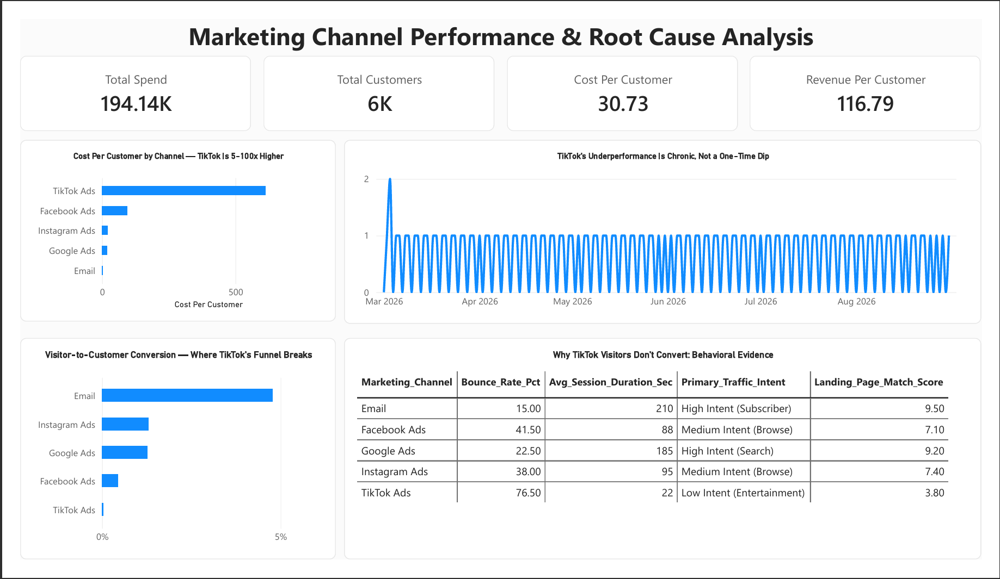

# Diagnosing a $612 Customer Acquisition Cost:
## Root Cause of TikTok Ad Inefficiency

A data-driven root cause investigation using SQL, Logic Trees, 5 Whys, and Power BI to identify why TikTok ad spend failed to convert.

**Tools:** SQL (PostgreSQL), Power BI, DAX, Excel, Root Cause Analysis (RCA), Logic Tree Analysis, 5 Whys Framework

---

## Executive Summary

### Business Question

Which marketing channels are using the marketing budget effectively, and which are not — and why? Across 184 days of activity, overall numbers appeared healthy ($194,140 total spend, ~6,000 customers acquired, $30.73 average CAC, and $116.79 Revenue Per Customer), but these top-line averages hid severe channel-level efficiency differences.

### Approach

A two-stage investigation was conducted using PostgreSQL and Power BI. Stage 1 applied a Logic Tree to isolate **WHERE** inefficiency was concentrated (by channel, campaign, and date). Stage 2 executed a **5 Whys** funnel and behavioral analysis to diagnose **WHY** the drop-off occurred.

### Key Finding

TikTok Ads generated a Cost Per Customer of $612.88—dramatically higher than any other channel. The failure did not occur at the click stage (CTR was competitive at 4.75%), but at the post-click transition: TikTok exhibited a 0.03% visitor-to-customer conversion rate driven by low-intent traffic, a 76.5% bounce rate, low audience age alignment (41%), and poor landing page relevance (3.8/10).

### Three Recommendations

1. **Reallocate Ad Spend Strategically:** Shift spend from TikTok toward proven, high-ROI channels (Email and Google Ads) while optimizing TikTok campaigns.
2. **Fix Audience Targeting & Alignment:** Refine TikTok target demographics to improve audience-age match (currently 41%) and capture higher-intent traffic.
3. **Optimize Landing Page Relevance:** Redesign post-click landing pages to match TikTok ad messaging and increase landing page relevance scores above 3.8/10.

---

## Dashboard Preview



---

## The Finding, In Numbers

| Marketing Channel | Total Spend | Customers Acquired | Cost Per Customer (CAC) | Visitor-to-Customer Conversion Rate | Revenue Per Customer |
| --- | --- | --- | --- | --- | --- |
| **TikTok Ads** | Highest Share | Fewest | **$612.88** | **0.03%** | $101.04 |
| **Facebook Ads** | Moderate | Moderate | $95.87 | 0.38% | $106.91 |
| **Instagram Ads** | Moderate | High | $22.33 | 1.13% | $111.58 |
| **Google Ads** | Moderate | High | $18.96 | 1.13% | $118.37 |
| **Email** | Low | High | $3.35 | 4.36% | $117.84 |
| **Total / Average** | **$194,140** | **~6,000** | **$30.73** | **—** | **$116.79** |

---

## Business Problem

A company is investing heavily in digital marketing, but not all channels are producing customers efficiently.

The key business question is:

> Which marketing channels are using the marketing budget effectively, and which are not — and why?

Across 184 days of marketing activity, the company spent approximately **$194,140**, acquired around **6,000 customers**, achieved an average **Cost Per Customer of $30.73**, and generated approximately **$116.79 Revenue Per Customer**.

While these overall numbers appear healthy, they hide major differences between marketing channels.

---

## Methodology

Rather than assuming a cause, the investigation followed two stages:

- **Stage 1: WHERE is the problem?** Identify where marketing inefficiency is concentrated.
- **Stage 2: WHY is it happening?** Use funnel analysis and behavioral metrics to determine the root cause.

```text
ROOT PROBLEM
Marketing spend efficiency varies sharply by channel
│
├── WHERE is the problem concentrated?
│   ├── By Channel
│   ├── By Campaign
│   └── By Date
│
└── WHY is it happening?
    ├── Click-Through Rate
    ├── Funnel Analysis
    ├── Visitor Behavior
    ├── Audience & Landing Page Fit
    └── Customer Value
```

### Stage 1: WHERE Analysis

#### By Channel

The first step was identifying which marketing channel was creating the inefficiency.

**Findings:**

- TikTok Ads: $612.88 Cost Per Customer
- Facebook Ads: $95.87 Cost Per Customer
- Instagram Ads: $22.33 Cost Per Customer
- Google Ads: $18.96 Cost Per Customer
- Email: $3.35 Cost Per Customer

**Insight:** TikTok Ads consumed the largest share of marketing spend while producing the fewest customers. Customer acquisition cost was dramatically higher than every other marketing channel.

**Conclusion:** The inefficiency is concentrated in TikTok Ads.

#### By Campaign

Next, I investigated whether a single TikTok campaign was causing the problem.

**Findings:** All TikTok campaigns showed similarly poor results.

**Insight:** The problem was not caused by one underperforming campaign.

**Conclusion:** The issue exists across the entire TikTok channel.

#### By Date

The next question was whether TikTok's poor performance occurred during only a short period.

**Findings:** TikTok consistently generated very few customers throughout the six-month analysis period.

**Insight:** The problem was persistent and not caused by a temporary decline.

**Conclusion:** TikTok underperformance is a chronic issue rather than a short-term anomaly.

---

### Stage 2: WHY Analysis

#### Why #1 – Is TikTok Failing to Generate Clicks?

To answer this question, I calculated Click-Through Rate (CTR) for each channel.

**Findings:**

- Email: 8.22%
- TikTok Ads: 4.75%
- Google Ads: 4.57%
- Instagram Ads: 3.90%
- Facebook Ads: 2.71%

**Insight:** TikTok generated a CTR comparable to other marketing channels. Users were clicking on TikTok ads.

**Conclusion:** The problem is not occurring at the click stage.

#### Why #2 – Are Visitors Dropping Off After Clicking?

I analyzed the complete marketing funnel:

**Impressions → Clicks → Website Visitors → New Customers**

**Findings:** TikTok successfully drove traffic to the website but converted very few visitors into customers.

- Email: 4.36% Visitor-to-Customer Conversion
- Google Ads: 1.13% Visitor-to-Customer Conversion
- Instagram Ads: 1.13% Visitor-to-Customer Conversion
- Facebook Ads: 0.38% Visitor-to-Customer Conversion
- TikTok Ads: 0.03% Visitor-to-Customer Conversion

**Insight:** The largest drop-off occurred between **Website Visitors → Customers**.

**Conclusion:** The problem occurs after visitors arrive on the website.

#### Why #3 – Why Don't Visitors Convert?

I combined marketing performance data with behavioral metrics.

**Findings — TikTok Ads:**

- Bounce Rate: 76.5%
- Session Duration: 22 Seconds

**Insight:** Most TikTok visitors left the website quickly and spent very little time engaging with content.

**Conclusion:** Visitors are arriving but not engaging.

#### Why #4 – Why Are Visitors Disengaging?

Behavioral analysis revealed several issues.

**Findings — TikTok Ads:**

- Traffic Intent: Low Intent (Entertainment)
- Audience Age Match: 41%
- Landing Page Match Score: 3.8 / 10

**Insight:** TikTok traffic was poorly aligned with both the target audience and the landing page experience. Many visitors clicked out of curiosity rather than purchase intent.

**Conclusion:** Audience targeting and landing-page relevance are likely contributing to poor conversion performance.

#### Why #5 – Are TikTok Customers Less Valuable?

I compared Revenue Per Customer across channels.

**Findings:**

- Google Ads: $118.37
- Email: $117.84
- Instagram Ads: $111.58
- Facebook Ads: $106.91
- TikTok Ads: $101.04

**Insight:** Customer value was relatively similar across channels.

**Conclusion:** The problem is not customer value. The problem is acquiring customers efficiently.

---

## Root Cause

TikTok's underperformance is primarily driven by low-intent entertainment traffic, weak audience-age targeting (41% match), and low landing-page relevance (3.8/10), which result in a 76.5% bounce rate and a near-zero (0.03%) visitor-to-customer conversion rate.

---

## Business Recommendations

1. **Improve Audience Targeting:** Focus campaigns on audience segments that better match the company's target customer profile.
2. **Improve Landing Page Relevance:** Create landing pages that better align with TikTok ad messaging and visitor expectations.
3. **Test New Creative Approaches:** Experiment with different ad formats, offers, and messaging.
4. **Reallocate Budget:** Shift a portion of marketing spend toward higher-performing channels such as Google Ads and Email while improving TikTok performance.
5. **Monitor Funnel Metrics:** Track Cost Per Customer, Visitor-to-Customer Conversion Rate, Bounce Rate, and Revenue Per Customer to measure improvement over time.

---

## Dataset

This project uses a synthetic dataset generated with the assistance of Google Gemini and Claude for portfolio and learning purposes.

### `campaigns`

Daily marketing performance data.

| Column | Description |
| --- | --- |
| `Order_Date` | Marketing activity date |
| `Marketing_Channel` | Advertising channel |
| `Campaign` | Campaign name |
| `Ad_Spend` | Marketing spend |
| `Impressions` | Ad views |
| `Clicks` | Ad clicks |
| `Website_Visitors` | Website visitors |
| `New_Customers` | Customers acquired |
| `Revenue` | Revenue generated |
| `Conversion_Status` | Converted / Not Converted |

### `channel_behavior`

Channel-level behavioral data used to investigate visitor engagement.

| Column | Description |
| --- | --- |
| `Marketing_Channel` | Advertising channel |
| `Avg_Session_Duration_Sec` | Average session duration |
| `Bounce_Rate_Pct` | Bounce rate percentage |
| `Primary_Traffic_Intent` | Visitor intent classification |
| `Audience_Age_Match_Pct` | Audience-target match |
| `Ad_Format` | Ad format used |
| `Landing_Page_Match_Score` | Ad-to-landing-page relevance score |

---

## Repository Structure

```text
├── README.md
├── data/
│   ├── campaigns.csv
│   └── channel_behavior.csv
├── sql/
│   ├── 01_root_problem.sql
│   ├── 02_where_by_channel.sql
│   ├── 03_where_by_campaign.sql
│   ├── 04_where_by_date.sql
│   ├── 05_why_ctr.sql
│   ├── 06_why_funnel_analysis.sql
│   └── 07_why_behavior_analysis.sql
├── dashboard/
│   └── marketing_rca_dashboard.pbix
└── images/
    └── dashboard_screenshot.png
```

---

## Key Takeaway

> TikTok Ads successfully generated traffic but failed to convert visitors into customers. The evidence suggests that the primary issue is not ad visibility or customer value, but poor audience alignment and low-intent traffic that results in high bounce rates and weak conversion performance.
